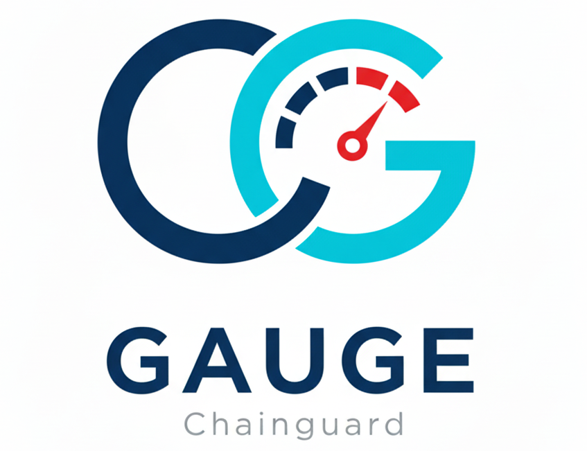

# Gauge

**Gauge your container security posture** - A unified tool for comprehensive container vulnerability assessments comparing the risks, the costs, and the "hardeness" (via [CHPs](https://github.com/chps-dev/chps)) of other container images as compared to [Chainguard Containers](https://www.chainguard.dev/containers).

## Features

### Core Capabilities
- **Dual Output Types**: Generate vulnerability assessment summaries (HTML) or cost analysis reports (XLSX)
- **CHPs Scoring**: Container Hardening and Provenance Scanner integration for evaluating non-CVE security factors like provenance, SBOM quality, signing, and container hardening practices
- **Intelligent Caching**: Digest-based caching dramatically improves performance on repeated scans
- **Parallel Scanning**: Multi-threaded image scanning for optimal performance
- **Comprehensive Analysis**: Detailed vulnerability breakdowns by severity (Critical, High, Medium, Low, Negligible)

### Vulnerability Assessment Summary (HTML)
- Professional PDF-optimized assessment reports with Chainguard branding
- Executive summaries from markdown files
- Custom appendix support for organization-specific content
- CVE reduction metrics and visual comparisons
- Side-by-side image vulnerability analysis
- Focus: Security posture overview and vulnerability findings

### Vulnerability Cost Analysis (XLSX)
- Detailed ROI calculations for Chainguard adoption
- CVE backlog remediation cost estimates
- Projected future CVE costs based on historical data
- Optional FIPS implementation cost analysis
- Auto-detection of FIPS images
- Interactive formulas for scenario planning
- Focus: Financial planning and business case development

## Prerequisites

- **Python**: 3.10 or higher
- **Docker or Podman**: Container runtime for image operations
- **Grype**: Vulnerability scanner
  ```bash
  # macOS
  brew install anchore/grype/grype

  # Linux
  curl -sSfL https://raw.githubusercontent.com/anchore/grype/main/install.sh | sh -s -- -b /usr/local/bin
  ```
- **Syft**: SBOM generator
  ```bash
  # macOS
  brew install syft

  # Linux
  curl -sSfL https://raw.githubusercontent.com/anchore/syft/main/install.sh | sh -s -- -b /usr/local/bin
  ```

## Installation

```bash
# Clone the repository
cd gauge

# Install dependencies
pip install -r requirements.txt

# Install as a package (recommended)
pip install -e .
```

## Quick Start

### Simplest Usage (with defaults)

With sensible defaults, you can run Gauge with minimal configuration:

```bash
gauge
```

This will:
- Read from `images.csv`
- Generate both `gauge_output.html` and `gauge_output.xlsx`
- Use `exec-summary.md` and `appendix.md` if they exist
- Use default ROI parameters (3 hours/CVE, $100/hour)

### Generate Vulnerability Cost Analysis (XLSX)

Generate a comprehensive cost analysis with ROI calculations:

```bash
gauge --output cost_analysis \
      --output-file-name cost-analysis \
      --customer "Acme Corp"
```

This will create `cost-analysis.xlsx`.

### Generate Vulnerability Assessment Summary (HTML)

Generate an executive assessment summary report:

```bash
gauge --output vuln_summary \
      --output-file-name assessment \
      --customer "Acme Corp"
```

This will create `assessment.html`.

### Generate Both Outputs

Generate both assessment summary (HTML) and cost analysis (XLSX):

```bash
gauge --output both \
      --output-file-name report \
      --customer "Acme Corp"
```

This will create `report.html` and `report.xlsx`.

### With FIPS Cost Analysis

Add FIPS implementation cost calculations (XLSX only):

```bash
gauge --output cost_analysis \
      --output-file-name cost-analysis \
      --auto-detect-fips
```

This will auto-detect FIPS images from their names and create `cost-analysis.xlsx` with FIPS cost analysis included.

### With CHPS Hardening & Provenance Scoring

Include CHPS (Container Hardening and Provenance Scanner) scoring:

```bash
gauge --output both \
      --output-file-name report \
      --with-chps
```

This will include CHPS scores in both HTML and XLSX outputs. CHPS evaluates non-CVE security factors like provenance, SBOM quality, signing, and container hardening practices.

**Note:** CHPS runs in a container automatically. The first time you use `--with-chps`, the tool will pull the `ghcr.io/chps-dev/chps-scorer:latest` image. No local installation required!

## Input Format

Create a CSV file with image pairs (one per line):

```csv
alternative_image,chainguard_image
python:3.12,cgr.dev/chainguard-private/python:latest
nginx:1.25,cgr.dev/chainguard-private/nginx:latest
postgres:16,cgr.dev/chainguard-private/postgres:latest
```

Optional header row is automatically skipped.

## Command-Line Options

### Input/Output Options

| Option | Default | Description |
|--------|---------|-------------|
| `-s, --source` | `images.csv` | Source CSV file with image pairs |
| `-o, --output` | `both` | Output type: `cost_analysis` (XLSX), `vuln_summary` (HTML), or `both` |
| `--output-file-name` | `gauge_output` | Base filename for output files |

### Common Options

| Option | Default | Description |
|--------|---------|-------------|
| `-c, --customer` | "Customer" | Customer name for report branding |
| `--max-workers` | 4 | Number of parallel scanning threads |
| `--platform` | - | Platform for scans (e.g., linux/amd64) |
| `-v, --verbose` | - | Enable verbose logging |

### Assessment Summary Options (HTML)

| Option | Default | Description |
|--------|---------|-------------|
| `-e, --exec-summary` | `exec-summary.md` | Markdown file for executive summary (optional if file doesn't exist) |
| `-a, --appendix` | `appendix.md` | Markdown file for custom appendix (optional if file doesn't exist) |

### Cost Analysis Options (XLSX)

| Option | Default | Description |
|--------|---------|-------------|
| `--hours-per-vuln` | 3.0 | Average hours to remediate one CVE |
| `--hourly-rate` | 100.0 | Engineering hourly rate in USD |
| `--auto-detect-fips` | - | Auto-detect FIPS images from names |

### CHPS Integration

| Option | Default | Description |
|--------|---------|-------------|
| `--with-chps` | - | Include CHPS (Container Hardening and Provenance Scanner) scoring |

### Cache Options

| Option | Default | Description |
|--------|---------|-------------|
| `--cache-dir` | .cache | Cache directory |
| `--no-cache` | - | Disable caching |
| `--clear-cache` | - | Clear cache before starting |
| `--no-fresh-check` | - | Skip checking for fresh images |

## Architecture

Gauge uses a modern `src/` layout with clean separation of concerns:

```
gauge/
├── src/                   # Source code (modern src/ layout)
│   ├── core/              # Core business logic
│   │   ├── __init__.py
│   │   ├── models.py      # Domain models
│   │   ├── scanner.py     # Vulnerability scanning
│   │   └── cache.py       # Intelligent caching
│   ├── outputs/           # Output generators
│   │   ├── __init__.py
│   │   ├── base.py        # Abstract interface
│   │   ├── html_generator.py
│   │   └── xlsx_generator.py
│   ├── integrations/      # External services
│   │   ├── __init__.py
│   │   ├── kev_catalog.py     # CISA KEV integration
│   │   └── chainguard_api.py
│   ├── utils/             # Utility modules
│   │   ├── __init__.py
│   │   ├── docker_utils.py
│   │   ├── roi_calculator.py
│   │   └── fips_calculator.py
│   ├── __init__.py        # Package root
│   ├── __main__.py        # Entry point for python -m gauge
│   └── cli.py             # Command-line interface
│
├── tests/                 # Unit tests
│
├── README.md              # This file
├── MIGRATION.md           # Migration guide
├── requirements.txt       # Dependencies
└── setup.py               # Package configuration
```

### Key Design Principles

1. **SOLID Principles**: Clean interfaces, single responsibilities
2. **Immutable Data**: Frozen dataclasses prevent accidental mutation
3. **Type Safety**: Comprehensive type hints throughout
4. **Modern Python**: Uses `src/` layout (Python best practice)
5. **Dependency Injection**: Testable, mockable components

## Caching System

Gauge includes an intelligent caching system:

### How It Works
- Uses image digests (SHA256) as cache keys
- Automatically checks if remote images are newer
- Stores scan results as individual JSON files
- Platform-aware (different cache per platform)

### Benefits
- **Significant speedup**: Cached scans return instantly
- **Automatic freshness**: Only pulls when remote digest differs
- **Reliable**: Digest-based validation ensures accuracy
- **Portable**: Cache can be shared between machines

### Cache Management

```bash
# View cache statistics (automatic in logs)
# Cache: 15 hits, 5 misses (75.0% hit rate)

# Clear cache before run
gauge --clear-cache ...

# Disable caching
gauge --no-cache ...

# Custom cache location
gauge --cache-dir /path/to/cache ...
```

## Performance

### Optimization Features
- **Parallel scanning**: Multiple images scanned simultaneously
- **Intelligent caching**: Digest-based cache eliminates redundant scans
- **Efficient SBOM usage**: Syft SBOM reused for Grype scanning
- **Auto-tuned workers**: Defaults to optimal thread count

### Typical Performance
- First scan: ~30-60 seconds per image pair
- Cached scan: < 1 second per image pair
- With 4 workers: 3-5x faster than sequential

## Examples

### Basic Vulnerability Assessment Summary

Generate a simple assessment summary report:

```bash
gauge --source my-images.csv \
      --output vuln_summary \
      --output-file-name assessment \
      --customer "Acme Corporation"
```

This creates `assessment.html`.

### Full Cost Analysis with FIPS

Generate a comprehensive cost analysis with ROI and FIPS calculations:

```bash
gauge --source production-images.csv \
      --output cost_analysis \
      --output-file-name cost-analysis \
      --customer "Acme Corp" \
      --hours-per-vuln 4 \
      --hourly-rate 125 \
      --auto-detect-fips \
      --max-workers 8
```

This creates `cost-analysis.xlsx`.

### Generate Both Outputs

Generate both assessment summary and cost analysis in one scan:

```bash
gauge --source my-images.csv \
      --output both \
      --output-file-name complete-report \
      --customer "Acme Corp" \
      --exec-summary summary.md \
      --hours-per-vuln 4 \
      --hourly-rate 125
```

This creates `complete-report.html` and `complete-report.xlsx`.

### High-Performance Scan

Maximize scanning speed for large fleets:

```bash
gauge --source large-fleet.csv \
      --output vuln_summary \
      --output-file-name fleet-assessment \
      --max-workers 12 \
      --no-fresh-check  # Skip freshness checks for speed
```

This creates `fleet-assessment.html`.

## Troubleshooting

### Common Issues

**"Neither docker nor podman found"**
- Ensure Docker or Podman is installed and in PATH
- Test with `docker --version` or `podman --version`

**"syft is required but not found"**
- Install Syft following prerequisites above
- Test with `syft version`

**"grype is required but not found"**
- Install Grype following prerequisites above
- Test with `grype version`

**Slow scanning**
- Use `--cache-dir` to enable caching
- Increase `--max-workers` for more parallelism
- Use `--no-fresh-check` to skip image freshness validation

**Cache issues**
- Clear cache with `--clear-cache`
- Disable caching with `--no-cache`
- Check cache directory permissions

## Development

### Running Without Install

```bash
# Using PYTHONPATH
PYTHONPATH=src python -m cli --help

# Or use the development script
python -m src.cli --help
```

### Running Tests

```bash
# Run unit tests (when available)
pytest tests/

# Type checking
mypy src/

# Code formatting
black src/
```

## Migration from Legacy Tools

If you're migrating from `cg_assessment` or `minibva`, see **[MIGRATION.md](MIGRATION.md)** for detailed instructions.

**Quick migration:**
- `python -m gauge` → `gauge`
- `python3 minibva.py` → `gauge`
- All features preserved, much simpler commands!

## Contributing

Gauge consolidates and improves upon two previous tools:
- `cg_assessment`: HTML/PDF report generator
- `minibva`: XLSX ROI calculator

The unified tool maintains 100% feature parity with both while adding:
- Cleaner architecture with `src/` layout
- Better error handling
- Improved performance
- Enhanced logging
- Type safety throughout

## License

Copyright © 2025 Chainguard. All Rights Reserved.

## Support

For issues, questions, or contributions, please contact your Chainguard representative.

---

**Built with [Claude Code](https://claude.com/claude-code)**
